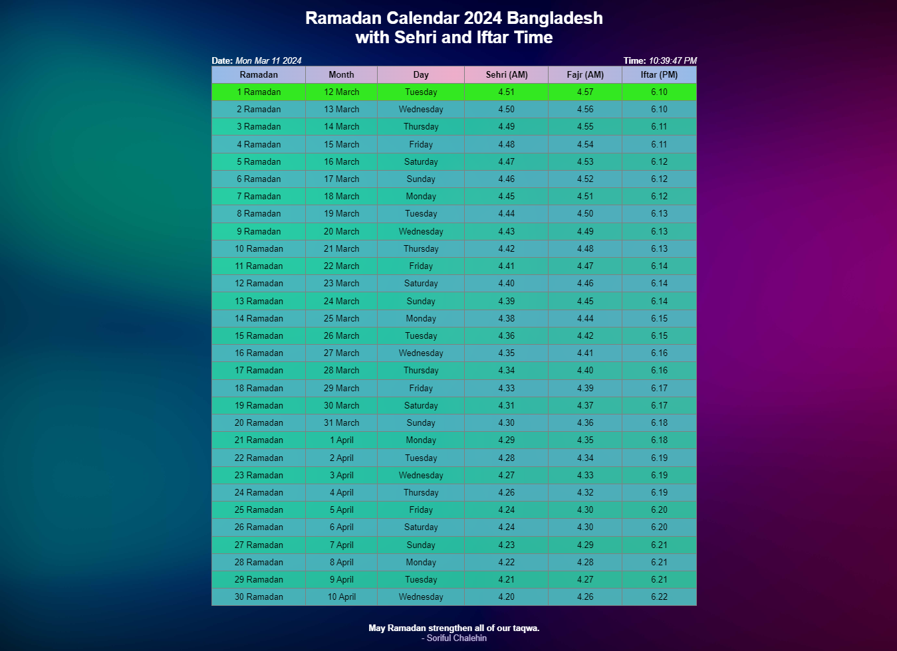

# Ramadan Calender for 2024

Overview:<br>
The Ramadan Calendar 2024 project is a web application designed to provide users with a dynamic and interactive Ramadan calendar. Developed using HTML, CSS, and JavaScript, this project offers features such as dynamic highlighting of the current day, real-time date and time display, and more.




## Features

- **Dynamic highlighting of the current row:** The current row is highlighted in a different color for easy identification. <br>
- **Real-time date and time display:** The current date and time are displayed dynamically on the calendar. Explore the live demo [here](https://soriful-chalehin.github.io/Ramadan-Calendar-2024).
- **User-Friendly Interface:** The calendar is designed with a clean and intuitive interface for a seamless user experience.

## Table of Contents

1. [Getting Started](#getting-started)
2. [Features](#features)
3. [Live Demo](https://soriful-chalehin.github.io/Ramadan-Calendar-2024)
4. [Contact the Developer](#contact-the-developer)
5. [License](#license)

## Getting Started
To get started with the Ramadan Calendar 2024 project, follow these steps:

**Clone the repository:**
```bash
git clone https://github.com/Soriful-Chalehin/Ramadan-Calendar-2024.git
```
**Navigate to the project directory:**
```bash
cd ramadan-calendar-2024
```
**Open the project in a web browser:**
- Open the index.html file in your preferred web browser.

### Live Demo
Check out the live demo of the calender [here](https://soriful-chalehin.github.io/Ramadan-Calendar-2024).

### Contact the Developer
For any questions, suggestions, or to connect, reach out to Soriful Chalehin:

<ul>
    <li><a href='https://facebook.com/Chalehin'> Follow me on Faceobook.</li>
    <li><a href='https://soriful-chalehin.github.io'> Website.</li>
    <li><a href='mailto:developersoriful@gmail.com'> E-mail </li>
</ul>
License:<br>
This project is licensed under the MIT License.
